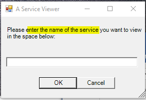
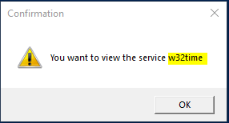
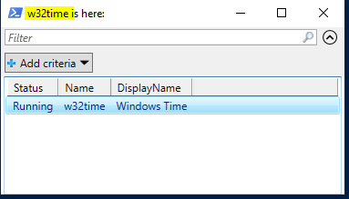

# its372
Course materials and demos for labs

## Lab04: Powershell programming - GUI programs

### 1. Description
In this lab, create a PowerShell script to show Windows services.

### 2. Steps (40%, each step 10%)
1. Display a input box to the user,

 

2. the user can enter a service name 

3. Get the service name from the input box and confirm it to the user with MessageBox 

4. Once the service exists, show it in a gridview

. 

Checking the existence of the service is NOT required.

### 3. Review questions (60%)
1. (10%) Create a Powershell script to view file content as a hex viewer. Name the script file name as hexview.ps1.
   1. (3%) Usage: hexview -filename <filename>. Show this in step 3.
   2. (3%) Exception handling: show a warning if the file to be viewed not exist, otherwise show its content. Show this in step 3.
   3. (4%) Code this script and show it works as expected.
2. (25% )Create a simple Powershell script using [Microsoft.PowerShell.Archive](https://docs.microsoft.com/en-us/powershell/module/microsoft.powershell.archive/?) to backup Windows events about security, and test it works
   1. (15%) Create the script
   2. (10%) Test the script
3. (25%) Use [ScheduledTasks](https://docs.microsoft.com/en-us/powershell/module/scheduledtasks/?) to 
   1. (10%) create a task named MyDailyRoutine that runs the simple Powershell script daily (set it runs every minute for testing purpose)
   2. (10%) verify the scheduled task is triggered as expected
   3. (5%) delete the scheduled task

**Demo video**

* [Lab04: Powershell programming I - GUI programming](https://youtu.be/WxrEpOw5hfk)

## References:
* [Inputbox](https://docs.microsoft.com/en-us/powershell/scripting/samples/creating-a-custom-input-box?view=powershell-6)
  * [MessageBox](https://michlstechblog.info/blog/powershell-show-a-messagebox/)
* [About script](https://docs.microsoft.com/en-us/powershell/module/microsoft.powershell.core/about/about_scripts?)
  * [Pause PowerShell script](https://stackoverflow.com/questions/3963100/how-do-you-do-a-pause-with-powershell-2-0) 
  * [format-hex](https://docs.microsoft.com/en-us/powershell/module/microsoft.powershell.utility/format-hex?)
* [ScheduledTasks](https://docs.microsoft.com/en-us/powershell/module/scheduledtasks/?)
  * [Scheduled Task with Daily Trigger and Repetition Interval](https://stackoverflow.com/questions/20108886/scheduled-task-with-daily-trigger-and-repetition-interval/34365268)
  * [Managing Services](https://docs.microsoft.com/en-us/powershell/scripting/samples/managing-services?)
    * [Writing Windows Services in PowerShell](https://docs.microsoft.com/en-us/archive/msdn-magazine/2016/may/windows-powershell-writing-windows-services-in-powershell)
* [Microsoft.PowerShell.Archive](https://docs.microsoft.com/en-us/powershell/module/microsoft.powershell.archive/?)
* [Add “Run with PowerShell (Admin)” Context Menu for .PS1 Files](https://www.top-password.com/blog/add-run-with-powershell-admin-context-menu-for-ps1-files/)
  * [How to Set .PS1 Script to Open with PowerShell By Default](https://www.top-password.com/blog/set-ps1-script-to-open-with-powershell-by-default/)
  * [Run with PowerShell missing from context menu](https://lukestoolkit.blogspot.com/2018/12/run-with-powershell-missing-from.html)
  * [How to prevent from closing out-gridview when a script finishes](https://stackoverflow.com/questions/2097904/how-to-prevent-from-closing-out-gridview-when-a-script-finishes)

